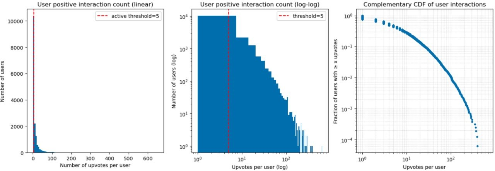
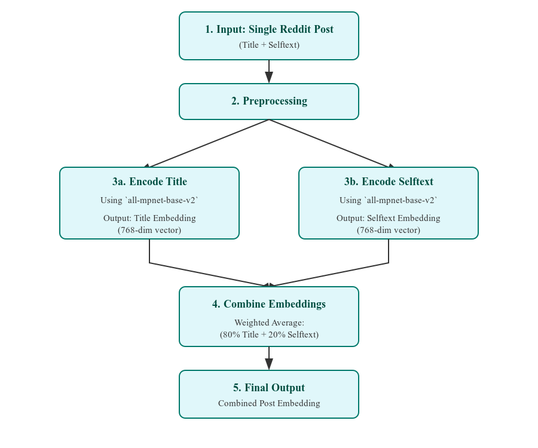
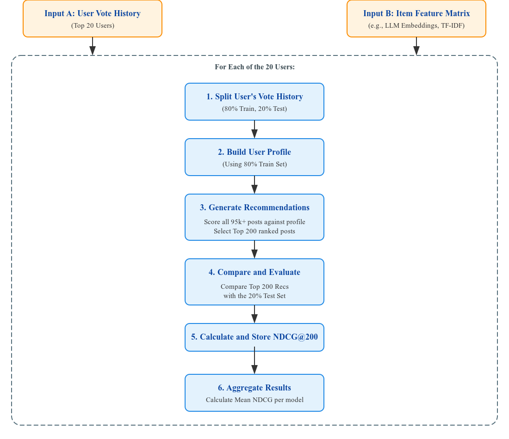
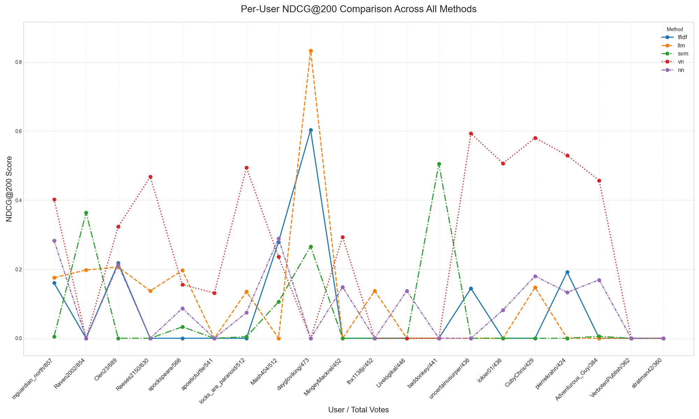
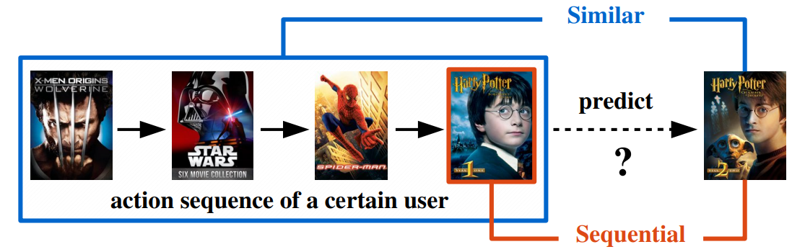
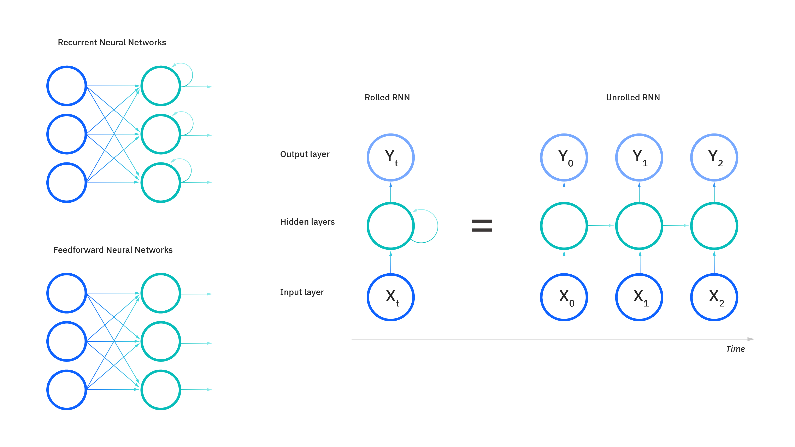
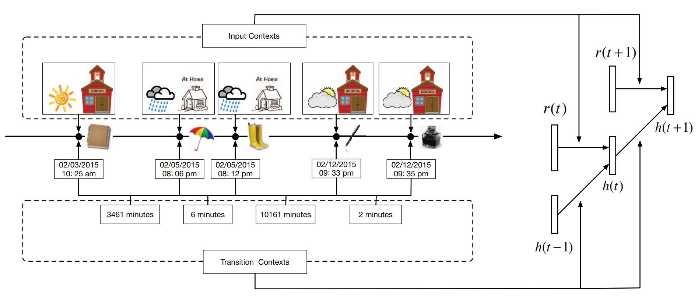

# AskReddit Project Report

## 1 Commercial System Analysis: Reddit's Recommendation Engine

The primary commercial system for our recommendation scenario is Reddit's own multifaceted recommendation engine. It is designed to keep millions of users engaged by personalizing the content they see across the platform. Understanding its strengths and limitations is key to motivating our own project's proposal.

### 1.1 Mechanisms to recommend content

The personalized home feed is the main touchpoint for users. The default best sort is a complex algorithm that prioritizes content from communities a user frequently interacts with. It considers not only post scores and age but also the user's historical activity within those subreddits.

Besides, features like the "Explore" tab and notifications for trending posts are designed to introduce users to new content and communities that are algorithmically determined to be relevant to their interests.

Personalized content is not the only source of recommendation. For example, `r/popular` and `r/all` serve as global, non-personalized feeds that showcase the most popular content across the entire platform, providing a broad view of what is currently trending.

### 1.2 Strengths

Reddit's system has several undeniable strengths:

- Scalability and Engagement: It operates effectively at a massive scale, successfully serving real-time recommendations to millions of users and fostering high levels of engagement within established communities.
- Community-Centric Model: The "Best" sort is extremely effective at reinforcing a user's existing interests by keeping them up-to-date with the communities they already love.

### 1.3 Weaknesses and Motivation for Our Project

Despite its strengths, Reddit's system has inherent weaknesses that directly motivate the approach taken in our project:

- The "Filter Bubble" Effect: By heavily prioritizing content from a user's subscribed subreddits, the system can inadvertently limit discovery. It excels at showing a user more of what they already know, but it is less effective at helping them discover new, thematically similar content from communities they don't follow.
- Limited Granularity Within Subreddits: Reddit's recommendations are often driven by community-level signals rather than the specific content of individual posts. A user might upvote a philosophical post in a large, diverse subreddit like r/Showerthoughts, but the algorithm might then recommend a popular but unrelated pun from the same community. It struggles to differentiate between the varied content within a single subreddit.

Our project was designed to address these specific limitations. By focusing on purely content-based filtering, we aimed to build a system that recommends posts based on what they are about, not just where they were posted. Our core proposal was to see if we could break the "filter bubble" by identifying thematically similar posts regardless of their subreddit of origin.

By focusing on a single, highly diverse subreddit like r/Showerthoughts, we created a perfect test case to evaluate if our content-based models (like LLM embeddings and Vector Negation) could achieve a more granular understanding of user preferences than a purely community-based model. Our goal was to prove the value of a content-first approach in a challenging real-world scenario.

## 2 Summary of Approaches

### 2.1 Datasets

Our project utilized the "Huge Collection of Reddit Votes" dataset available on Kaggle. This dataset is composed of two primary files: a vote log containing over 44 million user votes and a submissions file detailing over 22 million posts across 139,000 subreddits.

Given the project's scope, we made the strategic decision to narrow our focus to a single, highly active community: r/Showerthoughts. This decision allowed us to perform a deep, content-focused analysis without the confounding variable of cross-community user behavior.

### 2.2 Preprocessing and Data Fetching

We filtered the master submissions file to isolate all posts belonging to r/Showerthoughts, resulting in a corpus of 95,084 unique posts after removing entries with no title.

We then filtered the `44_million_vote.txt` file to extract all historical upvotes corresponding to these posts.

And to ensure our analysis focused on the platform's most engaged members, we identified the top 20 users with the most upvotes in our dataset.

The primary strength of this dataset is its scale and authenticity, providing real-world user interaction data. Its main weakness, particularly for content-based filtering, is the idiosyncratic and diverse nature of the content, which presents a significant challenge in creating coherent user taste profiles.

|  |
|:--:|
| *Exploratory analysis of the dataset. The interaction is extremely unbalanced. Vast majority of users have very few positive feedbacks, and only a small number of users are highly active.* |

### 2.3 Methodologies

To address the recommendation problem, our team developed and evaluated a suite of models. For evaluation, all methods produced a ranked list of 200 recommendations.

#### 2.3.1 TF-IDF Vectorizer (Baseline)

This classic approach served as our strong baseline to measure the effectiveness of keyword-matching.

- Implementation/Library: We used the TfidfVectorizer from Python's scikit-learn library.
- Preprocessing: The title and selftext for each post were concatenated into a single text field.
- Parameters: The vectorizer was configured with the following parameters: `stop_words='english'` to remove common words, `max_df=0.95` to ignore terms appearing in more than 95% of documents, and `min_df=2` to ignore very rare terms.
- User Profiling & Ranking: The user profile was built using the same time-decay weighted average method as the LLM, and ranking was also performed using cosine similarity.

#### 2.3.2 LLM Embedding with Semantic Similarity

In this project I mainly focused on utilizing LLM to generate entry embeddings. This approach was designed to move beyond simple keyword matching and understand the deep semantic meaning of the content. The core idea is to represent each post as a dense vector in a high-dimensional space where proximity indicates semantic similarity.

|  |
|:--:|
| *Workflow of Generating Embeddings* |

The entire workflow was implemented using the [sentence-transformers](https://sbert.net/) library, a framework built on top of PyTorch that simplifies the use of pre-trained models for embedding generation.

##### 2.3.2.1 Bidirectional Encoder Representations from Transformers

Or BERT, is a model that fundamentally changed how machines understand natural language. Before BERT, models were largely unidirectional, meaning they read text either from left-to-right or right-to-left. BERT's key innovation was its ability to learn from the entire context of a sentence at once. As this paper by Google AI language[^1] states, "BERT is designed to pre-train deep bidirectional representations from unlabeled text by jointly conditioning on both left and right context in all layers." This bidirectional understanding allows it to grasp context and nuance in a way that was previously not possible.

[^1]: 2018, BERT: Pre-training of Deep Bidirectional Transformers for Language Understanding, <https://doi.org/10.48550/arXiv.1810.04805>

##### 2.3.2.2 Masked Language Modeling

Masked Language Modeling (MLM) is the pre-training technique introduced with BERT. Its biggest innovation was enabling a model to learn from both left and right context simultaneously, creating a truly bidirectional understanding of language.

Instead of trying to predict the next word in a sentence, MLM randomly hides a certain percentage of words in the input text and then tasks the model with predicting only those hidden words. As stated in the paper by Google AI language team, the objective is to "predict the original vocabulary id of the masked word based only on its context."

To prevent the model from simply learning to focus on the `[MASK]` token, BERT uses a strategy for the 15% of words it randomly chooses to hide:

- 80% of the time, the word is replaced with the `[MASK]` token (my dog is hairy → my dog is `[MASK]`).
- 10% of the time, the word is replaced with a random word (my dog is hairy → my dog is apple).
- 10% of the time, the word is left unchanged (my dog is hairy → my dog is hairy).

This forces the model to maintain a rich contextual understanding of every word, as it never knows which one it will be asked to predict.

##### 2.3.2.3 Permuted Language Modeling

Permuted Language Modeling (PLM) was introduced with XLNet to address a key limitation of MLM. While MLM learns from bidirectional context, it assumes that each masked word is predicted independently of the others.

PLM introduces an autoregressive approach, similar to traditional language models, but on a shuffled or "permuted" version of the sentence. For a given permutation of a sentence, the model predicts the words one by one, but in the new shuffled order.

This solves MLM's independence assumption. As this paper about MPNet[^2] explains, "PLM factorizes the predicted tokens with the product rule in any permuted order... which avoids the independence assumption in MLM and can better model dependency among predicted tokens." For example, if the model has to predict "New" and "York", PLM allows the model to use its prediction of "New" to help it predict "York".

[^2]: 2020, MPNet: Masked and Permuted Pre-training for Language Understanding, <https://doi.org/10.48550/arXiv.2004.09297>

The main weakness of PLM is that during its autoregressive prediction, it doesn't know the original positions of the words that come later in the permuted sequence. This creates a "discrepancy between pre-training and fine-tuning," because during fine-tuning, the model always sees the un-permuted sentence.

|  |
|:--:|
| *Note. A unified view of MLM and PLM, where $x_i$ and $p_i$ represent token and position embeddings. The left side in both MLM (a) and PLM (b) are in original order, while the right side in both MLM (a) and PLM (b) are in permuted order and are regarded as the unified view. From "MPNet: Masked and Permuted Pre-training for Language Understanding," by Kaitao Song, 2020, Nanjing University of Science and Technology* |

##### 2.3.2.4 Neural Network Architecture and Training

We selected the `all-mpnet-base-v2` model, a high-performance sentence-transformer variant. The model was pre-trained on a massive dataset of over 1 billion text pairs from a diverse range of sources, including a large portion of Reddit comments[^3]. It was then fine-tuned using a contrastive learning objective, where the model learns to pull semantically similar sentences closer together in the vector space while pushing dissimilar ones apart. After processing, the model provides us with a 768-dimension vector for each post, which serves as its semantic fingerprint.

**Hybrid Approach**

`all-mpnet-base-v2` is based on the MPNet (Masked and Permuted Pre-training) architecture, which itself is a novel pre-training method that leverages both MLM and PLM.

MLM assumes that each masked word is predicted independently of the others. For example, if a sentence is "The capital of New `[MASK]` is Albany", BERT tries to predict the word "York" without knowing that it might also have to predict other words in the sentence. So instead of masking words in their original positions, PLM shuffles the order of words in a sentence and then predicts them one by one in that new, permuted order. This forces the model to learn the relationships and dependencies between the words it needs to predict.

When PLM predicting a word in a shuffled sequence, the model doesn't know the original positions of the words that come after it in the shuffle. This creates a mismatch between how the model is pre-trained and how it's used for downstream tasks, where it always sees the full, ordered sentence. With position compensation however, MPNet can take auxiliary position information as input to make the model see a full sentence and thus reducing the position discrepancy.

|  |
|:--:|
| *Note. (a) The structure of MPNet. (b) The attention mask of MPNet. The light grey lines in (a) represent the bidirectional self-attention in the non-predicted part $(x_{z \le c},M_{z \gt c})=(x_1,x_5,x_3,[M],[M],[M])$, which correspond to the light grey attention mask in (b). The blue and green mask in (b) represent the attention mask in content and query streams in two-stream selfattention, which correspond to the blue, green and black lines in (a). From "MPNet: Masked and Permuted Pre-training for Language Understanding," by Kaitao Song, 2020, Nanjing University of Science and Technology* |

##### 2.3.2.5 Suitability for Generating Embeddings

The posts in `r/Showerthoughts` are not just simple statements; they often rely on clever wordplay, puns, or complex logical connections. The ability of MPNet to model the dependency between words is crucial for correctly interpreting these nuanced thoughts.

Also, by eliminating the position discrepancy, MPNet ensures that its understanding of a sentence is always grounded in its original structure. This prevents misinterpretations and allows the model to generate more accurate and reliable semantic embeddings, which is the foundation of our content-based recommendation model.

[^3]: [sentence-transformers/all-mpnet-base-v2 · Hugging Face](https://huggingface.co/sentence-transformers/all-mpnet-base-v2#training-data)

##### 2.3.2.6 Preprocessing

For each post, the title and selftext were extracted. Since titles are often more concise and representative of a post's core idea, we created a single representative vector for each post by calculating a weighted average of the two embeddings. The title embedding was given a 80% weight, and the selftext embedding was given a 20% weight. This combined vector was then used for all subsequent calculations.

##### 2.3.2.7 User Profiling

To model a user's taste, we constructed a profile vector from their historical upvotes. To account for evolving interests, we implemented a time-decay weighted average. Using a `decay_rate` of 0.95, this method gives exponentially more weight to recent upvotes, ensuring the user profile is more reflective of their current tastes rather than being a simple average of all past interactions.

##### 2.3.2.8 Ranking Function

Recommendations were generated by ranking all candidate posts based on their similarity to the user's profile. We used Cosine Similarity as our similarity function, which measures the cosine of the angle between the user profile vector and each post vector. A higher cosine similarity score (closer to 1.0) indicates a stronger semantic match. The top 200 posts with the highest similarity scores were selected as the final recommendations for evaluation.

#### 2.3.3 Support Vector Machine

##### 2.3.3.1 Core Concept and Goal

We decided to treat the recommendation task as a classification problem: could we predict whether a user would upvote or downvote a post? This led us to the Support Vector Machine (SVM), as it allowed us to build a dedicated model for each user designed to learn the line between content they like and dislike.

- **Objective:** To predict a user's vote on a given post.
- **Approach:** For each of our top 20 users, we trained a separate SVM classifier. The model learns a decision boundary, or hyperplane, in a high-dimensional feature space that best separates the posts the user has historically upvoted from those they have downvoted. Recommendations are then generated by ranking new posts based on their distance from this learned boundary.

##### 2.3.3.2 Model Selection and Parameters

We chose a Linear SVM for its efficiency and effectiveness with high-dimensional, sparse text data.

- **Implementation:** We used the SVC (Support Vector Classifier) class from Python's scikit-learn library.
- **Kernel:** A linear kernel was selected. This is a standard and computationally efficient choice for text classification problems where the number of features (i.e., the vocabulary size from TF-IDF) is large.
- **Class Weighting:** The `class_weight` parameter was set to `balanced`. This is a crucial step that automatically adjusts the weights of the classes to be inversely proportional to their frequencies. It mitigates the issue of data imbalance (where a user might have many more upvotes than downvotes, or vice versa), preventing the model from being biased towards the majority class.
- **Feature Scaling:** Before training, the TF-IDF feature vectors were normalized using `StandardScaler(with_mean=False)`. Scaling is essential for SVMs as their decision boundary is sensitive to the magnitude of feature values. We set `with_mean=False` because centering sparse data (like TF-IDF output) would destroy its sparsity and make it computationally intractable.

##### 2.3.3.3 General Workflow

**Data Preparation and Feature Engineering**

For each post in the dataset, the title and selftext were concatenated into a single text string to create a comprehensive content representation.

This combined text was then converted into numerical feature vectors using TfidfVectorizer from scikit-learn. We limited the vocabulary to the top 5000 features and removed common English stop words to reduce noise.

**Per-User Model Training**

For each of the top 20 users, we filtered their voting history from the 80% training split of the data. A user was only considered for modeling if they had a minimum of 3 upvotes and 3 downvotes in their training history, ensuring the classifier had examples of both classes to learn from.

The corresponding TF-IDF vectors for their upvoted and downvoted posts were stacked into a training matrix $X_{train}$, and a corresponding label vector $y_{train}$ was created (1 for upvotes, 0 for downvotes).The trained SVM classifier then learned the optimal hyperplane to separate these two classes in the 5000-dimensional feature space.

**Generating Recommendations**

For each user with a trained model, we took all 95,000+ posts from the dataset (excluding those in the user's training set). We used the model's `decision_function` to calculate a score for each of these posts. This score represents the signed distance of a post's vector from the learned hyperplane.

A larger positive distance indicates a higher confidence that the post belongs to the "upvote" class. The posts were ranked in descending order based on this score, and the top 200 were selected as the final recommendations for evaluation.

#### 2.3.4 Vector Negation

Vector Negation (VN) model is a sophisticated hybrid approach that was the top-performing method in our experiments. Its core innovation is to create a highly personalized user profile by not only modeling what a user likes but also by explicitly modeling and removing the concepts they dislike.

The main objective is to generate recommendations that are similar to a user's upvoted content while being dissimilar to their downvoted content. This method represents user tastes and post content in a vector space. It constructs a "positive" user profile by combining the vectors of keywords from upvoted posts. It then purifies this profile by projecting it onto the subspace of "negative" keywords (from downvoted posts) and subtracting this projection. This results in a final user profile vector that is orthogonal to the concepts the user dislikes.

##### 2.3.4.1 Model Selection

- **Keyword Extraction:** We used the YAKE! library, a lightweight and unsupervised keyword extractor. This approach was chosen to distill the most important concepts from each post's text without requiring a pre-trained corpus, focusing only on the local statistical features of the text.

- **Word Embeddings:** Keywords were converted into vectors using BPEmb, a collection of pre-trained subword embeddings based on Byte-Pair Encoding. We used the English model with a vocabulary size of 50,000. BPEmb was chosen for its ability to handle out-of-vocabulary words and its strong performance in general NLP tasks.

- **Hybrid Scoring:** The final recommendation score is a weighted sum of two components:

  1. **Content Score:** The cosine similarity between the post's vector and the user's final profile vector.
  2. **Social Score:** The post's total upvote count, normalized using MinMaxScaler to be between 0 and 1. The `up_weight` hyperparameter controls the balance between these two scores. Our experiments showed that a weight of 0.5 provided the best results, giving equal importance to personal taste and social proof.

##### 2.3.4.2 General Workflow

**Data Preparation and Feature Engineering**

For each post, the `YAKE!` algorithm was used to extract a list of keywords, which were then converted into a "bag of words." The upvote count for each post was normalized to a score between 0 and 1 to be used in the final ranking step.

**Per-User Profile Construction**

For each of the top 20 users, their voting history from the training set was separated into upvoted and downvoted posts. Then a  "positive" vector was created by summing the BPEmb vectors of all unique keywords found in the user's upvoted posts. This is based on the principle that A OR B OR C can be modeled by the linear combination of their vectors. Meanwhile, a set of "negative" keywords was created from the user's downvoted posts.

To purify the user profile, we performed the following steps:

- An orthonormal basis for the subspace spanned by the negative keyword vectors was computed using Singular Value Decomposition (SVD).
- The positive profile vector was projected onto this "dislike" subspace.
- This projection was then subtracted from the original positive profile vector. The resulting vector is orthogonal to the user's disliked concepts, effectively removing unwanted themes from their taste profile.

**Generating Recommendations**

For each user, all candidate posts were scored. The final score for each post was calculated as:

$$score = {1-up\_weight}*content\_similarity +\\up\_weight * normalized\_upvotes$$

The posts were ranked in descending order based on this final hybrid score, and the top 200 were selected as the final recommendations for evaluation.

#### 2.3.5 MLP Neural Network

This approach utilizes a standard Multi-Layer Perceptron (MLP) to tackle the recommendation task. The problem is framed as a personalized binary classification problem for each user, where the goal is to predict whether a user will upvote or downvote a given post based on its content.

##### 2.3.5.1 Model Selection

We used a standard MLP architecture, leveraging its ability to learn from complex data without extensive feature engineering.

- **Implementation/Library:** We used the MLPClassifier from Python's scikit-learn library.
- **Neural Network Architecture:** The final model consisted of two hidden layers with 128 and 64 nodes, respectively. This architecture was chosen after experimentation as it provided a good balance between model capacity and the risk of overfitting on the relatively small per-user datasets.
- **Solver and Loss Function:** We used the default adam solver, an efficient stochastic gradient-based optimizer, and the default log-loss (binary cross-entropy) function, which is standard for binary classification tasks.
- **Data Imbalance Handling:** A user's voting history is often highly imbalanced (e.g., far more upvotes than downvotes). To address this, we used the SMOTE (Synthetic Minority Over-sampling Technique) from the im-blearn library. SMOTE balances the dataset by generating new, synthetic examples of the minority class, preventing the model from becoming biased towards the majority class.

##### 2.3.5.2 Workflow

The `title` of each post was preprocessed by converting it to lowercase, removing non-alphanumeric characters, tokenizing it, removing common English stop words, and applying Porter stemming to reduce words to their root form. The processed text was then converted into numerical feature vectors using `TfidfVectorizer` from `scikit-learn`, with the vocabulary limited to the top 5000 features and a `min_df` of 3 to filter out extremely rare terms.

In the training section, for each of the top 20 users, their voting history was merged with the post content. We first sorted the data chronologically and then performed a temporal split. We used the oldest 80% of a user's posts for training and reserved the newest 20% for testing.

The SMOTE algorithm was applied to the training set to create a balanced dataset of upvotes and downvotes. The `MLPClassifier` was then trained on this resampled data for a maximum of 50 iterations.

For each user, the trained MLP model was used to predict the probability of an "upvote" for every post in the test set. These posts were then ranked in descending order based on their predicted upvote probability. The top 200 posts from this ranked list were selected as the final recommendations for evaluation.

#### 2.3.6 Sentence-BERT and LightFM

This method implements a hybrid recommender system that combines the strengths of both content-based and collaborative filtering. The core idea is to enrich a powerful matrix factorization model (LightFM) with a diverse set of high-quality content features, with Sentence-BERT embeddings serving as the primary semantic component.

To maximize the relevance and diversity of recommendations, we used the LightFM framework, which is specifically designed to learn from such data, and supply it with a rich feature set for each post. This allows the model to make recommendations even for new items and to understand the nuanced relationships between content features and user preferences.

##### 2.3.6.1 Methodology

**Recommendation Model**

LightFM is ideal for this task as it natively supports implicit feedback (upvotes) and can seamlessly incorporate both user-item interactions and item features into a single learning framework.

We performed a hyperparameter search over several loss functions suitable for implicit feedback, including `warp`, `warp-kos`, and `bpr`. The BPR (Bayesian Personalized Ranking) loss function was selected as it yielded the best performance on our validation set. The final model was trained with `no_components=30`, `user_alpha=1e-07` (user regularization), `item_alpha=1e-07` (item regularization), and a `learning_rate=0.05`.

**Feature Engineering**

We used the lightweight but powerful `all-MiniLM-L6-v2` model from the sentence-transformers library. The `title` and `selftext` from the original dataset were combined, and the SBERT model was used to generate a 384-dimensional embedding for each post. The embeddings were normalized to prevent their magnitude from dominating the learning process.

**Sentiment Scores**

We used the TextBlob library to generate a sentiment score for each post. To use numerical metadata like `num_comments`, `ups`, and `age_hours`, we first applied a `log(1+x)` transformation to handle their long-tail distributions. These transformed features were then scaled to a `[0, 1]` range using `MinMaxScaler`.

## 3 Evaluation

To fairly compare the performance of the diverse recommender models developed, we designed a consistent offline evaluation framework. The evaluation was designed to simulate a real-world recommendation scenario by predicting a user's future preferences based on their past interactions, in response to the unique and challenging characteristics of our chosen datasets.

### 3.1 Challenges

#### 3.1.1 Data Sparsity

Our exploratory analysis showed that a vast majority of users have very few votes, while a tiny fraction are highly active. We chose to focus our evaluation on the top 20 most active users. Evaluating on users with only a handful of votes would be statistically noisy and unreliable. By concentrating on the most engaged users, we could get a clearer, more stable signal of model performance.

#### 3.1.2 Low Hit Rate

The r/Showerthoughts dataset contains nearly 100,000 unique posts. For any given user, their test set consists of only a few dozen posts at most, which may produce a low `Recall@N` and `NDCG@N`, while not displaying the true effectiveness of our models considering the rare nature of the dataset.

For this problem, we selected `NDCG@200` as our primary metric. Stricter metrics like `NDCG@10` would almost always yield a score of zero, not because the models are bad, but because the probability of a specific item landing in such a small target area is tiny. `NDCG@200` provides a wider, more forgiving window. It rewards models for ranking relevant items highly anywhere in the top 200, making it a more sensitive and useful metric for comparing models in a massive item catalog.

#### 3.1.3 Implicit Feedback and Temporal Shifting

We only have historical voting data, not explicit ratings. Furthermore, we lack negative feedback for the vast majority of posts a user sees but simply ignores. This makes the user preference noisier.

Also user tastes can change over time. An upvote from two years ago is likely a weaker indicator of a user's current interests than an upvote from last week.

We tackled both problems with a temporal holdout for each user. We split each user's voting history chronologically, using the oldest 80% of votes for training and the newest 20% for testing. This practice for offline evaluation simulates a scenario where predicting a user's future behavior is based on their past actions. On the other hand a random split would be unrealistic, as it would allow the model to "see into the future" by training on recent data to predict older interactions, causing data leakage[^4] that would produce misleading results.

[^4]: [Data Leakage - Kaggle](https://www.kaggle.com/code/alexisbcook/data-leakage#Introduction)

### 3.2 Experimental Workflow

**Selection of Test Subjects**

The exploratory data analysis revealed a long-tail distribution in user activity. To ensure our evaluation was based on a strong and reliable signal, we focused on the top 20 most active users within our `r/Showerthoughts` dataset, as determined by their total vote count.

**Per-User Temporal Holdout**

For each of the 20 test users, we split their historical voting data chronologically. The oldest 80% of a user's votes were designated as the training set, used to construct their taste profile. The most recent 20% of their votes were held out as the test set or ground truth, representing the content we aimed to predict. This temporal split is crucial as it prevents data leakage and accurately reflects a real-world use case.

**Recommendation Generation**

For each user, every model was tasked with generating a ranked list of 200 personalized post recommendations. This list was created by scoring all 95,000+ posts in the dataset (excluding those already seen in the user's training set) against the user's profile.

**Performance Measurement**

The generated list of 200 recommendations was then compared against the user's test set to calculate performance metrics for each model.

|  |
|:-:|
| *Workflow for the evaluation process.* |

### 3.3 Evaluation Metrics and Justification

Choosing the right metric is critical, especially given the unique challenges of our dataset. We initially considered standard classification metrics like `Precision@N` and `Recall@N`. However these were deemed unsuitable for our primary evaluation. As noted in our exploratory analysis, the dataset is extremely sparse. For any given user, the test set is a tiny fraction of the total post catalog. This means that Precision and Recall scores are often zero, not because a model is poor, but because the chance of a specific item landing in a short top-N list is statistically very low. This makes it difficult to meaningfully compare models.

Thus we came up with a better metric called Normalized Discounted Cumulative Gain (NDCG). We selected NDCG as our primary metric for its robustness and suitability for this task. Unlike Precision, which treats all positions in a recommendation list equally, NDCG is a rank-aware metric. It addresses the core requirement of placing the most relevant items at the top of the list as for a recommender. It does this by assigning a higher score for relevant items found at higher ranks and applying a logarithmic discount for items found further down. This directly reflects a better user experience.

**Justification for N=200**

We chose to evaluate at a relatively large N of 200. In a massive catalog of nearly 100,000 posts, a stricter N (e.g., N=10) would be too unforgiving and would likely result in zero scores for most models, obscuring any performance differences. `NDCG@200` provides a wider, more realistic window to evaluate a model's ability to rank relevant items highly, even if they don't appear in the absolute top positions. It allows us to differentiate between a model that ranks a relevant item at position 150 and one that fails to find it at all, a distinction that would be lost with a smaller N.

### 3.4 Evaluation Results

|Approach|NDCG@200|
|---:|:---|
|**<u>TF-IDF (baseline)​</u>**|0.0798|
|**Neural Network**|0.0089​|
|**SVM**|0.0645|
|**Sentence-BERT**|0.0898​|
|**LLM**|0.1083|
|**Vector Negation**|0.2585​|

|  |
|:---:|
|*The red dotted line for VN achieves overall high scores for many users where other models struggled. The LLM and TF-IDF models are still remarkable for users with consistent tastes, as seen with the user `daygloviking`. SVM and Neural Network continue to be relatively niche performers, but occasionally finding success for specific users* |

### 3.5 Final Proposed System

Our experiments demonstrated that no single model was universally superior for all users. The LLM-based approach excelled at understanding the nuanced content for users with consistent tastes, while the Vector Negation model proved the immense value of incorporating negative feedback and social proof. Taking all this into account, our final proposed system is a two-stage hybrid model. The goal was to combine the strengths of our best approaches while making it computationally efficient.

**Stage 1: Candidate Retrieval**

The first stage addresses the computational challenge of scoring over 95,000+ posts in real-time. In this stage, the system would select a smaller and more manageable set of a few hundred promising candidates. This would be achieved by combining two parallel methods:

- **Semantic Retrieval:** Use a fast Approximate Nearest Neighbor (ANN) index (e.g., FAISS, ScaNN) on our pre-computed LLM embeddings to instantly find posts that are semantically similar to a user's recent upvotes.
- **Popularity Retrieval:** Include a set of globally popular or trending posts to ensure novelty and address the cold-start problem for new users.

**Stage 2: Personalized Re-ranking**

The second stage takes the few hundred candidates from Stage 1 and applies a more sophisticated scoring model to produce the personalized ranked list for the user. This ranking model would be a hybrid that learns from multiple signals:

- **Semantic Match (from LLM):** The core of the score would be the cosine similarity between a candidate post's LLM embedding and the user's time-aware taste profile.
- **Negative Feedback (from Vector Negation):** The model would explicitly incorporate a "dissimilarity" score based on the candidate's similarity to the user's downvoted posts. This is the key insight from the Vector Negation model—to actively penalize content similar to what the user dislikes.
- **Social Proof (from Vector Negation):** The model would use the post's existing popularity (its upvote count) as a feature, leveraging the "wisdom of the crowd" as a powerful signal of quality and engagement.

## 4 Reflection

The process of developing this recommender system was a challenging within such limited time. Now with hindsight, many improvements could be made for better workflow and system performance.

### 4.1 Pros of the System

**Implementation of LLM Embeddings**

My primary contribution was the implementation of the LLM-based feature encoding pipeline. The process of selecting a good model, generating high-dimensional embeddings for the entire post corpus, and storing them efficiently was a major success. This provided a powerful set of semantic features that proved to be one of the top-performing methods in our final evaluation.

**Evolution of User Profiling**

Moving beyond a simple average of a user's liked items to a time-decay weighted average was a successful decision. This added a layer of sophistication to the model, allowing it to better reflect a user's most recent interests, which is crucial for a platform with rapidly changing content like Reddit.

**Rigorous and Iterative Evaluation**

The team's collective process of refining our evaluation methodology was a highlight. We correctly identified that our initial attempts with metrics like Precision and Recall were insufficient due to the dataset's sparsity. Moving to a more robust, rank-aware metric like `NDCG@200` was a critical decision that allowed us to draw meaningful conclusions from our experiments.

### 4.2 Cons of the System

**The Limitations of Purely Content-Based Filtering**

One major takeaway for us is that a purely content-based approach has its limits, especially for a dataset like this one. We found that content similarity alone often isn't enough to predict what a user will like. The frequent zero-scores in our results were not bugs, but rather a finding that for many users, taste is not easily captured by content similarity alone. The diverse and often unrelated nature of posts in r/Showerthoughts leads to "blurry" user profiles, making it incredibly difficult to predict specific future upvotes based on past ones.

**Initial Misleading Metrics**

An early attempt to frame the problem as a per-user vote prediction task was a notable failure. It resulted in a misleadingly perfect 100% accuracy score, which was a classic sign of a model overfitting on a small number of training examples in a high-dimensional feature space. This was a valuable lesson in the importance of choosing an appropriate evaluation framework that avoids such pitfalls.

### 4.3 Possible Improvements

**A Hybrid Approach**

The biggest lesson I learned is that for a social platform like Reddit, collaborative and social signals are essential. The outstanding performance of the Vector Negation model which incorporated both negative feedback and a post's popularity (social proof) is compelling evidence of this. Next time I would advocate for building a hybrid model from the outset, and try combining the semantic power of LLM embeddings with collaborative filtering techniques that learn from the behavior of similar users.

**Retrieve and Re-rank Pipeline**

We also realized early on that our method of scoring all 95,000 posts for every user just wasn't scalable. It works for our experiment, but it would be far too slow and expensive in a live system. A more practical and scalable approach would be a two-stage system. A fast, lightweight model (like an approximate nearest neighbor search on our LLM embeddings) could first retrieve a few hundred promising candidates. Then, a more complex and computationally intensive model could re-rank this much smaller set to produce the final, high-quality recommendation list.

**More Advanced User Profiling**

While the time-decay average was an improvement, I would explore more sophisticated methods for modeling user taste. Instead of representing a user with a single vector, we could model their interests as a mixture of multiple taste clusters, which would be better suited for users with diverse interests.

## 5 Adequacy for Commercial Viability

Even though this project is more academic and simplified, it's still necessary for us to assess the system's performance, data sufficiency and computational feasibility considering the commercial viability of our proposed recommender design.

### 5.1 Performance

One of the biggest concerns is the results so far are not promising for production environment. While models like Vector Negation and the LLM showed strong performance for certain users, the high number of zero-scores for others indicates a poor reliability. A commercial system requires consistent recommendations usually with high quality for the majority of its user base, not just a selected few. The current performance would likely lead to a unsatisfying experience for many users.

### 5.2 Data Sufficiency

The Reddit dataset from Kaggle is large, but it is not sufficient for building a robust commercial system due to its inherent limitations since it is only partial and lack lots of significant behavioral data for training and building user profile. One of the primary issues is the lack of complete user histories. For example we only have a fraction of the votes and no information on which posts users have seen but ignored. A commercial system would require access to the complete, real-time stream of user interactions to be effective for training the model.

### 5.3 Feasibility

The current approach of scoring all 95,000+ posts for every user is not computationally feasible for a real-time application since it's a time-consuming and compute demanding job. This method is acceptable for an offline experiment but would be far too slow and expensive to run for millions of users. The limitation is precisely why a more practical architecture, such as the two-stage retrieve and re-rank pipeline, would be necessary for a production environment.

## 6. Future Directions and Extensions

Our project successfully demonstrated the potential of content-based filtering, but we also noticed that several other advanced techniques could significantly enhance its performance and utility. In this section I'll explore how sequential social recommendation and more advanced LLM applications could be integrated into our system.

**Sequential Recommendation**

Our current time-decay model is a simplified form of temporal modeling. However a more sophisticated sequential recommendation approach could capture more complex patterns in a user's session.

Instead of just weighting past votes, we could model a user's upvote history as a sequence. Using techniques like Markov Models or a Recurrent Neural Network (RNN), we could predict the next likely post a user would be interested in based on the specific sequence of their recent upvotes. This is particularly relevant for "session-based" browsing, where a user might explore a specific theme (e.g., a series of posts about a single news event) before moving on to another.

We would need the user's voting history ordered by timestamp. The current dataset provides timestamps, so this is highly feasible. It would allow the recommender to be more adaptive and responsive to a user's current interests, rather than just their long-term average taste.

|  |
|:--:|
| *Note. An example of how a sequential model makes recommendations. From "Fusing Similarity Models with Markov Chains for Sparse Sequential Recommendation," by Ruining He, Julian McAuley, 2010, University of California, San Diego* |

|  |
|:--:|
| *Note. Recurrent neural networks use forward propagation and backpropagation through time (BPTT) algorithms to determine the gradients. The principles of BPTT are the same as traditional backpropagation, where the model trains itself by calculating errors from its output layer to its input layer. BPTT differs from the traditional approach in that BPTT sums errors at each time step whereas feedforward networks do not need to sum errors as they do not share parameters across each layer. From "What is a recurrent neural network (RNN)," by Cole Stryker, 2024, IBM* |

**Context-Aware Recommendation**

A user's preferences can change dramatically based on their current context. A context-aware system could adapt its recommendations accordingly.

We could incorporate contextual features into our model. For example, a user browsing on a mobile device on a Friday night might prefer shorter, more humorous content, while the same user browsing on a desktop during a weekday might be more receptive to longer, more serious posts. We could use techniques like Factorization Machines to model these complex interactions between user, item and context.

|  |
|:--:|
| *Note. The purchasing sequence of a user as an example of context-aware sequential recommendation. The left part shows input and transition contexts in a behavioral sequence. Input contexts mean external situations that users conduct behaviors, and transition contexts denote time intervals between adjacent behaviors. The right part illustrates how input and transition contexts contribute to predicting a user’s next behavior in recurrent neural networks. From "Context-aware Sequential Recommendation," by Qiang Liu, Shu Wu, 2016, IEEE 16th International Conference on Data Mining* |

We would need to augment our dataset with contextual information for each vote, such as the timestamp (which is already included), the user's device type, and potentially their geo location. While device and location data are not in the current dataset, they are standard in commercial systems. Implementing this would significantly improve the personalization and relevance of the recommendations.

**Social Network Recommendation**

Our project did not explicitly model the social connections between users, which is a powerful source of information on a platform like Reddit. In the furture, we could construct a social graph based on user interactions. For example, we could infer a connection between two users if they frequently comment on or upvote the same posts. A user's recommendations could then be influenced by the activity of their "social neighbors." This is a form of collaborative filtering that could help users discover new content that people with similar tastes have enjoyed.

This is less realistic with the current dataset. The lack of comment data is a major hurdle, but if it were available, this extension would be a powerful way to combat the low precision profile problem by leveraging the tastes of similar users.

**Advanced LLM Applications**

We only used an LLM for feature encoding, but its capabilities are far beyond that. We could use an LLM in a generative or conversational capacity. As shown introduced the week 8 slides, we could use a task-specific prompt to ask an LLM to generate an explanation for why a post is being recommended, revealing more details on the logic of recommending. No new data is required for this, but it would necessitate a significant change in the system's architecture to incorporate real-time LLM API calls.

While this method is more computationally expensive, providing explainable recommendations is a major area of research and can significantly improve user trust and satisfaction with a recommender system.

## 6 Acknowledgements

Thanks for all members in the "AskReddit" group. We've been through a lot of challenges and always stayed together to tackle them down. Really enjoyed cooperating with you guys. Also thanks for Mr. Wobcke's effort and other tutors' dedication to COMP9727 this term. I feel like really gained tons of new discoveries and insights in the recommender systems, which made me more interested in digging into this industry even further in the future.
