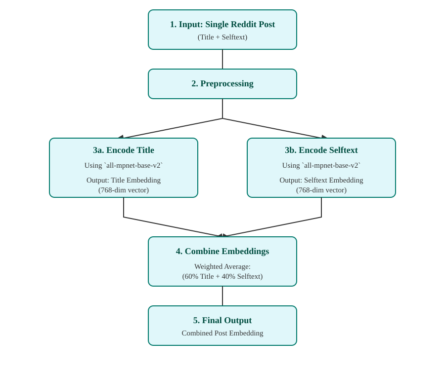
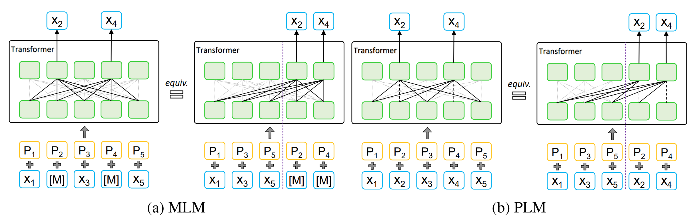
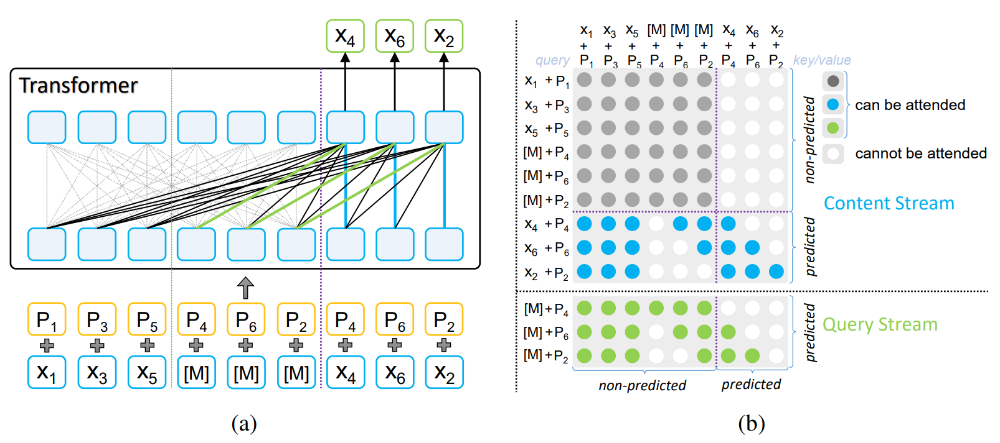
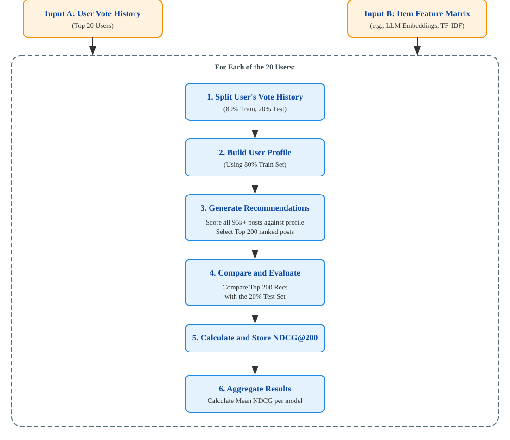

# AskReddit Project Report

> **Author:** Bob
> **zID:** z123456

**Marking**

- Content: Novel insights made concerning experiments and results.
- Structure: Logically organized into a coherent, easy to understand argument.
- Analysis: Novel interpretations of results supported by evidence.
- Presentation: Engaging style with clear explanations throughout.

## 1 Commercial System Analysis: Reddit's Recommendation Engine

The primary commercial system for our recommendation scenario is Reddit's own multifaceted recommendation engine. It is designed to keep millions of users engaged by personalizing the content they see across the platform. Understanding its strengths and limitations is key to motivating our own project's proposal.

### 1.1 Mechanisms to recommend content

The personalized home feed is the main touchpoint for users. The default "Best" sort is a complex algorithm that prioritizes fresh content from communities a user frequently interacts with. It considers not only post scores and age but also the user's historical engagement within those subreddits.

Besides, features like the "Explore" tab and notifications for trending posts are designed to introduce users to new content and communities that are algorithmically determined to be relevant to their interests.

Personalized content is not the only source of recommendation. For example, `r/popular` and `r/all` serve as global, non-personalized feeds that showcase the most popular content across the entire platform, providing a broad view of what is currently trending.

### 1.2 Strengths

Reddit's system has several undeniable strengths:

- Scalability and Engagement: It operates effectively at a massive scale, successfully serving real-time recommendations to millions of users and fostering high levels of engagement within established communities.
- Community-Centric Model: The "Best" sort is extremely effective at reinforcing a user's existing interests by keeping them up-to-date with the communities they already love.

### 1.3 Weaknesses and Motivation for Our Project

Despite its strengths, Reddit's system has inherent weaknesses that directly motivate the approach taken in our project:

- The "Filter Bubble" Effect: By heavily prioritizing content from a user's subscribed subreddits, the system can inadvertently limit discovery. It excels at showing a user more of what they already know, but it is less effective at helping them discover new, thematically similar content from communities they don't follow.
- Limited Granularity Within Subreddits: Reddit's recommendations are often driven by community-level signals rather than the specific content of individual posts. A user might upvote a philosophical post in a large, diverse subreddit like r/Showerthoughts, but the algorithm might then recommend a popular but unrelated pun from the same community simply because it's popular. It struggles to differentiate between the varied content within a single subreddit.

Our project was designed to address these specific limitations. By focusing on purely content-based filtering, we aimed to build a system that recommends posts based on what they are about, not just where they were posted. Our core proposal was to see if we could break the "filter bubble" by identifying thematically similar posts regardless of their subreddit of origin.

By focusing on a single, highly diverse subreddit like r/Showerthoughts, we created a perfect test case to evaluate if our content-based models (like LLM embeddings and Vector Negation) could achieve a more granular understanding of user preferences than a purely community-based model. Our goal was to prove the value of a content-first approach in a challenging real-world scenario.

## 2 Summary of Approaches

### 2.1 Datasets

Our project utilized the "Huge Collection of Reddit Votes" dataset available on Kaggle. This dataset is composed of two primary files: a vote log containing over 44 million user votes and a submissions file detailing over 22 million posts across 139,000 subreddits.

Given the project's scope, we made the strategic decision to narrow our focus to a single, highly active community: r/Showerthoughts. This decision allowed us to perform a deep, content-focused analysis without the confounding variable of cross-community user behavior.

### 2.2 Preprocessing and Data Fetching

We filtered the master submissions file to isolate all posts belonging to r/Showerthoughts, resulting in a corpus of 95,084 unique posts after removing entries with no title.

We then filtered the 44_million_vote.txt file to extract all historical upvotes corresponding to these posts.

For our final evaluation, we identified the top 20 users with the highest number of upvotes within our dataset to ensure our analysis was based on the platform's most engaged members.

The primary strength of this dataset is its scale and authenticity, providing real-world user interaction data. Its main weakness, particularly for content-based filtering, is the idiosyncratic and diverse nature of the content, which presents a significant challenge in creating coherent user taste profiles.

### 2.3 Methodologies

To address the recommendation problem, our team developed and evaluated a suite of models. For evaluation, all methods produced a ranked list of 200 recommendations.

#### 2.3.1 TF-IDF Vectorizer (Baseline)

This classic approach served as our strong baseline to measure the effectiveness of keyword-matching.

- Implementation/Library: We used the TfidfVectorizer from Python's scikit-learn library.
- Preprocessing: The title and selftext for each post were concatenated into a single text field.
- Parameters: The vectorizer was configured with the following parameters: `stop_words='english'` to remove common words, `max_df=0.95` to ignore terms appearing in more than 95% of documents, and `min_df=2` to ignore very rare terms.
- User Profiling & Ranking: The user profile was built using the same time-decay weighted average method as the LLM, and ranking was also performed using cosine similarity.

#### 2.3.2 MLP Neural Network

#### 2.3.3 LLM Embedding with Semantic Similarity

This approach was designed to move beyond simple keyword matching and understand the deep semantic meaning of the content. The core idea is to represent each post as a dense vector in a high-dimensional space where proximity indicates semantic similarity.

*Workflow of Generating Embeddings*

The entire workflow was implemented using the [sentence-transformers](https://sbert.net/) library, a framework built on top of PyTorch that simplifies the use of pre-trained models for embedding generation.

#### 2.3.3.1 Bidirectional Encoder Representations from Transformers
Or BERT, is a model that fundamentally changed how machines understand natural language. Before BERT, models were largely unidirectional, meaning they read text either from left-to-right or right-to-left. BERT's key innovation was its ability to learn from the entire context of a sentence at once. As this paper by Google AI language[^1] states, "BERT is designed to pre-train deep bidirectional representations from unlabeled text by jointly conditioning on both left and right context in all layers." This bidirectional understanding allows it to grasp context and nuance in a way that was previously not possible.

[^1]: 2018, BERT: Pre-training of Deep Bidirectional Transformers for Language Understanding, <https://doi.org/10.48550/arXiv.1810.04805>

#### 2.3.3.2 Masked Language Modeling

Masked Language Modeling (MLM) is the pre-training technique introduced with BERT. Its biggest innovation was enabling a model to learn from both left and right context simultaneously, creating a truly bidirectional understanding of language.

Instead of trying to predict the next word in a sentence, MLM randomly hides a certain percentage of words in the input text and then tasks the model with predicting only those hidden words. As stated in this paper[^1], the objective is to "predict the original vocabulary id of the masked word based only on its context."

To prevent the model from simply learning to focus on the `[MASK]` token, BERT uses a strategy for the 15% of words it randomly chooses to hide:

- 80% of the time, the word is replaced with the `[MASK]` token (my dog is hairy → my dog is `[MASK]`).
- 10% of the time, the word is replaced with a random word (my dog is hairy → my dog is apple).
- 10% of the time, the word is left unchanged (my dog is hairy → my dog is hairy).

This forces the model to maintain a rich contextual understanding of every word, as it never knows which one it will be asked to predict.

#### 2.3.3.3 Permuted Language Modeling

Permuted Language Modeling (PLM) was introduced with XLNet to address a key limitation of MLM. While MLM learns from bidirectional context, it assumes that each masked word is predicted independently of the others.

PLM introduces an autoregressive approach, similar to traditional language models, but on a shuffled or "permuted" version of the sentence. For a given permutation of a sentence, the model predicts the words one by one, but in the new shuffled order.

This solves MLM's independence assumption. As this paper about MPNet[^2] explains, "PLM factorizes the predicted tokens with the product rule in any permuted order... which avoids the independence assumption in MLM and can better model dependency among predicted tokens." For example, if the model has to predict "New" and "York", PLM allows the model to use its prediction of "New" to help it predict "York".

[^2]: 2020, MPNet: Masked and Permuted Pre-training for Language Understanding, <https://doi.org/10.48550/arXiv.2004.09297>

The main weakness of PLM is that during its autoregressive prediction, it doesn't know the original positions of the words that come later in the permuted sequence. This creates a "discrepancy between pre-training and fine-tuning," because during fine-tuning, the model always sees the un-permuted sentence.

*Note. A unified view of MLM and PLM, where $x_i$ and $p_i$ represent token and position embeddings. The left side in both MLM (a) and PLM (b) are in original order, while the right side in both MLM (a) and PLM (b) are in permuted order and are regarded as the unified view. From "MPNet: Masked and Permuted Pre-training for Language Understanding," by Kaitao Song, 2020, Nanjing University of Science and Technology*

#### 2.3.3.4 Neural Network Architecture and Training

We selected the `all-mpnet-base-v2` model, a high-performance sentence-transformer variant. The model was pre-trained on a massive dataset of over 1 billion text pairs from a diverse range of sources, including a large portion of Reddit comments[^3]. It was then fine-tuned using a contrastive learning objective, where the model learns to pull semantically similar sentences closer together in the vector space while pushing dissimilar ones apart. The model outputs a dense vector of 768 dimensions for each input text.

**Hybrid Approach**

`all-mpnet-base-v2` is based on the MPNet (Masked and Permuted Pre-training) architecture, which itself is a novel pre-training method that leverages both MLM and PLM.

MLM assumes that each masked word is predicted independently of the others. For example, if a sentence is "The capital of New `[MASK]` is Albany", BERT tries to predict the word "York" without knowing that it might also have to predict other words in the sentence. So instead of masking words in their original positions, PLM shuffles the order of words in a sentence and then predicts them one by one in that new, permuted order. This forces the model to learn the relationships and dependencies between the words it needs to predict.

When PLM predicting a word in a shuffled sequence, the model doesn't know the original positions of the words that come after it in the shuffle. This creates a mismatch between how the model is pre-trained and how it's used for downstream tasks, where it always sees the full, ordered sentence. With position compensation however, MPNet can take auxiliary position information as input to make the model see a full sentence and thus reducing the position discrepancy.

*Note. (a) The structure of MPNet. (b) The attention mask of MPNet. The light grey lines in (a) represent the bidirectional self-attention in the non-predicted part $(x_{z \le c},M_{z \gt c})=(x_1,x_5,x_3,[M],[M],[M])$, which correspond to the light grey attention mask in (b). The blue and green mask in (b) represent the attention mask in content and query streams in two-stream selfattention, which correspond to the blue, green and black lines in (a). From "MPNet: Masked and Permuted Pre-training for Language Understanding," by Kaitao Song, 2020, Nanjing University of Science and Technology*

#### 2.3.3.5 Suitability for Generating Embeddings

The posts in `r/Showerthoughts` are not just simple statements; they often rely on clever wordplay, puns, or complex logical connections. The ability of MPNet to model the dependency between words is crucial for correctly interpreting these nuanced thoughts.

Also, by eliminating the position discrepancy, MPNet ensures that its understanding of a sentence is always grounded in its original structure. This prevents misinterpretations and allows the model to generate more accurate and reliable semantic embeddings, which is the foundation of our content-based recommendation model.

[^3]: [sentence-transformers/all-mpnet-base-v2 · Hugging Face](https://huggingface.co/sentence-transformers/all-mpnet-base-v2#training-data)

#### 2.3.3.6 Preprocessing

For each post, the title and selftext were extracted. Since titles are often more concise and representative of a post's core idea, we created a single representative vector for each post by calculating a weighted average of the two embeddings. The title embedding was given a 80% weight, and the selftext embedding was given a 20% weight. This combined vector was then used for all subsequent calculations.

#### 2.3.3.7 User Profiling

To model a user's taste, we constructed a profile vector from their historical upvotes. To account for evolving interests, we implemented a time-decay weighted average. Using a decay_rate of 0.95, this method gives exponentially more weight to recent upvotes, ensuring the user profile is more reflective of their current tastes rather than being a simple average of all past interactions.

#### 2.3.3.8 Ranking Function

Recommendations were generated by ranking all candidate posts based on their similarity to the user's profile. We used Cosine Similarity as our similarity function, which measures the cosine of the angle between the user profile vector and each post vector. A higher cosine similarity score (closer to 1.0) indicates a stronger semantic match. The top 200 posts with the highest similarity scores were selected as the final recommendations for evaluation.

#### 2.3.4 Support Vector Machine

#### 2.3.5 Vector Negation

#### 2.3.6 Sentence-BERT and LightFM

## 3 Evaluation

To fairly compare the performance of the diverse recommender models developed, we designed a consistent offline evaluation framework. The evaluation was designed to simulate a real-world recommendation scenario by predicting a user's future preferences based on their past interactions, in response to the unique and challenging characteristics of our chosen datasets.

### 3.1 Challenges

#### 3.1.1 Data Sparsity

Our exploratory analysis showed that a vast majority of users have very few votes, while a tiny fraction are highly active. We chose to focus our evaluation on the top 20 most active users. Evaluating on users with only a handful of votes would be statistically noisy and unreliable. By concentrating on the most engaged users, we could get a clearer, more stable signal of model performance.

#### 3.1.2 Low Hit Rate

The r/Showerthoughts dataset contains nearly 100,000 unique posts. For any given user, their test set consists of only a few dozen posts at most, which may produce a low `Recall@N` and `NDCG@N`, while not displaying the true effectiveness of our models considering the rare nature of the dataset.

For this problem, we selected `NDCG@200` as our primary metric. Stricter metrics like `NDCG@10` would almost always yield a score of zero, not because the models are bad, but because the probability of a specific item landing in such a small target area is tiny. `NDCG@200` provides a wider, more forgiving window. It rewards models for ranking relevant items highly anywhere in the top 200, making it a more sensitive and useful metric for comparing models in a massive item catalog.

#### 3.1.3 Implicit Feedback and Temporal Shifting

We only have historical voting data, not explicit ratings. Furthermore, we lack negative feedback for the vast majority of posts a user sees but simply ignores. This makes the user preference noisier.

Also user tastes can change over time. An upvote from two years ago is likely a weaker indicator of a user's current interests than an upvote from last week.

To address both issues, we used a temporal holdout for every evaluated user. We split each user's voting history chronologically, using the oldest 80% of votes for training and the newest 20% for testing. This practice for offline evaluation simulates a scenario where predicting a user's future behavior is based on their past actions. On the other hand a random split would be unrealistic, as it would allow the model to "see into the future" by training on recent data to predict older interactions, causing data leakage[^3] that would produce misleading results.

[^3]: [Data Leakage - Kaggle](https://www.kaggle.com/code/alexisbcook/data-leakage#Introduction)

### 3.2 Experimental Workflow

Selection of Test Subjects: The exploratory data analysis revealed a long-tail distribution in user activity. To ensure our evaluation was based on a strong and reliable signal, we focused on the top 20 most active users within our `r/Showerthoughts` dataset, as determined by their total vote count.

Per-User Temporal Holdout: For each of the 20 test users, we split their historical voting data chronologically. The oldest 80% of a user's votes were designated as the training set, used to construct their taste profile. The most recent 20% of their votes were held out as the test set or "ground truth," representing the content we aimed to predict. This temporal split is crucial as it prevents data leakage and accurately reflects a real-world use case.

Recommendation Generation: For each user, every model was tasked with generating a ranked list of 200 personalized post recommendations. This list was created by scoring all 95,000+ posts in the dataset (excluding those already seen in the user's training set) against the user's profile.

Performance Measurement: The generated list of 200 recommendations was then compared against the user's test set to calculate performance metrics for each model.

*Workflow for the evaluation process.*

### 3.3 Evaluation Metrics and Justification

Choosing the right metric is critical, especially given the unique challenges of our dataset.

Initial Metric Considerations: We initially considered standard classification metrics like Precision@N and Recall@N. However, these were deemed unsuitable for our primary evaluation. As noted in our exploratory analysis, the interaction data is extremely sparse. For any given user, the test set (the "relevant" items) is a tiny fraction of the total post catalog. This "needle in a haystack" problem means that Precision and Recall scores are often zero, not because a model is poor, but because the chance of a specific item landing in a short top-N list is statistically very low. This makes it difficult to meaningfully compare models.

Primary Metric: Normalized Discounted Cumulative Gain (NDCG)
We selected NDCG as our primary metric for its robustness and suitability for this task.

Why NDCG? Unlike Precision, which treats all positions in a recommendation list equally, NDCG is a rank-aware metric. It addresses the core requirement of a good recommender: placing the most relevant items at the top of the list. It does this by assigning a higher score for relevant items found at higher ranks and applying a logarithmic discount for items found further down. This directly reflects a better user experience.

Justification for K=200: We chose to evaluate at a relatively large K of 200. In a massive catalog of over 95,000 posts, a stricter K (e.g., K=10) would be too unforgiving and would likely result in zero scores for most models, obscuring any performance differences. NDCG@200 provides a wider, more realistic window to evaluate a model's ability to rank relevant items highly, even if they don't appear in the absolute top positions. It allows us to differentiate between a model that ranks a relevant item at position 150 and one that fails to find it at all, a distinction that would be lost with a smaller K.

## 4 Reflection

## 5 Future Work
